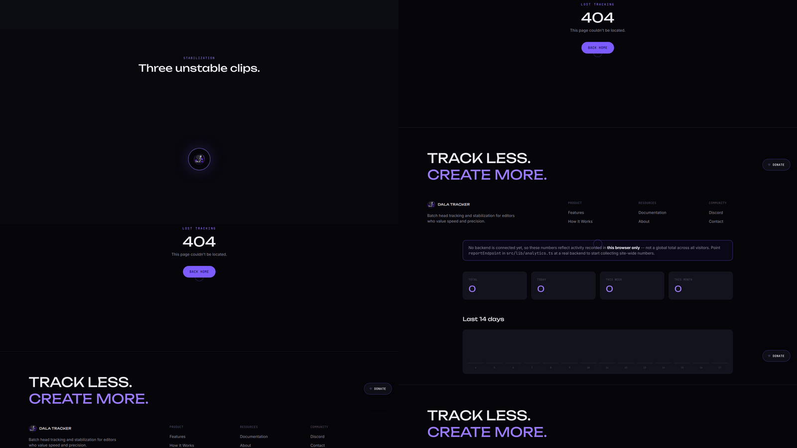

<p align="center">
  
</p>
<p align="center">


</p>
<h1 align="center">Dala Tracker</h1>

<p align="center">
  <strong>⚡ High-Speed Batch Head Tracking for Video Editors</strong>
</p>

<p align="center">
Track hundreds of clips in minutes with After Effects–style tracking results.
</p>

<p align="center">
  <a href="https://dala-tracker.vercel.app">
    
  </a>
  <a href="https://dala-tracker.vercel.app/download">
    
  </a>
</p>

---

# 🎬 Demo

<p align="center">
  
</p>

---

# ✨ Why Dala Tracker?

Dala Tracker is a desktop application designed for professional video editors who need fast and reliable motion tracking.

Instead of manually tracking every clip inside Adobe After Effects, Dala Tracker automates the entire process while producing tracking results inspired by the After Effects workflow.

Whether you're processing a single clip or an entire folder, Dala Tracker dramatically reduces the time spent on repetitive tracking tasks.

---

# 🚀 Features

- ⚡ Batch head tracking
- 📂 Process entire folders automatically
- 🎯 After Effects–style tracking workflow
- 📹 Supports multiple clips
- 💻 Modern desktop interface
- 🔥 Optimized for high-speed processing
- 📈 Built for professional editing workflows

---

# ⚙️ Workflow

```text
Import Videos
      │
      ▼
Automatic Batch Tracking
      │
      ▼
Review Results
      │
      ▼
Export Tracking Data
```

---

# 📸 Screenshots

<p align="center">
  
</p>

---

# 🛠 Installation

```bash
git clone https://github.com/anonymous291202/dala-tracker.git

cd dala-tracker

npm install

npm run dev
```

Or download the latest release directly from the website.

---

# 🧩 Built With

- React
- TypeScript
- Vite
- Tailwind CSS
- Framer Motion

---

# 🎯 Roadmap

- ✅ Batch tracking
- ✅ Multi-file processing
- ✅ Modern website
- ⏳ GPU acceleration
- ⏳ AI-assisted tracking
- ⏳ Advanced export formats

---

# 💬 Feedback

Found a bug or have a feature request?

Open an Issue or contact me through the website.

---

# 📄 License

This project is licensed under the MIT License.

---

<p align="center">
Made with ❤️ for the video editing community.
</p>
