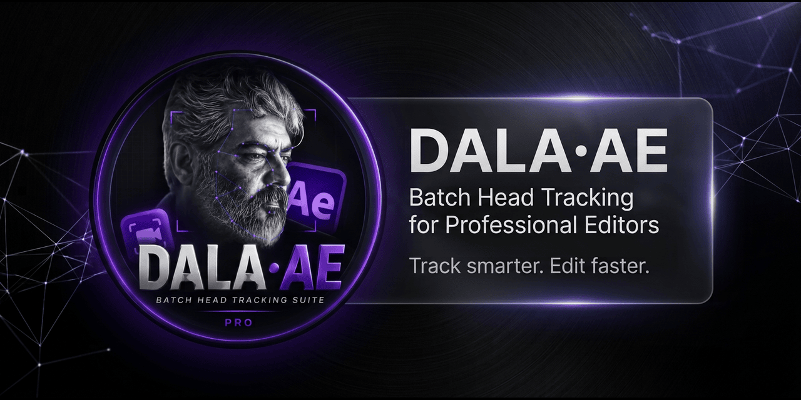
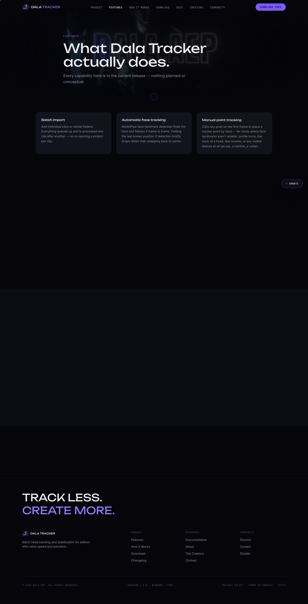
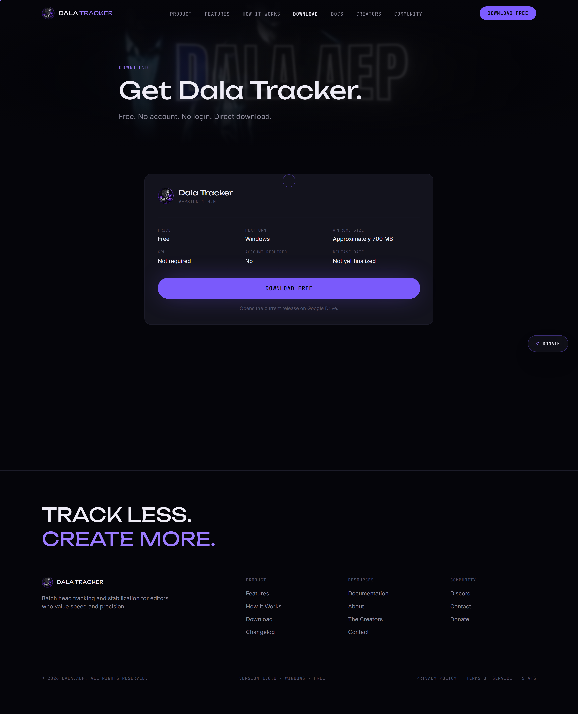
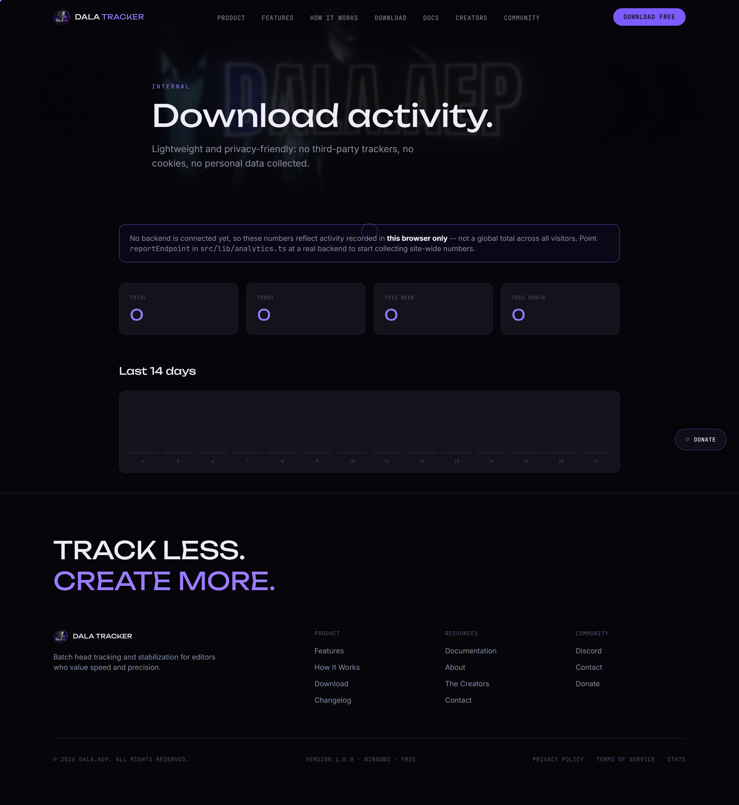

<p align="center">
  
</p>

<p align="center">


</p>

<h1 align="center">Dala Tracker</h1>

<p align="center">
Professional Batch Head Tracking Software for Video Editors.
</p>

<p align="center">
Track multiple clips with speed, accuracy, and a modern desktop workflow.
</p>

---

# Demo

<p align="center">

</p>

---

# Why Dala Tracker?

Manual tracking is repetitive and time consuming.

Dala Tracker streamlines the workflow by making batch head tracking fast, accurate, and easy to manage—allowing editors to spend more time creating and less time repeating the same tasks.

---

# Features

- Batch head tracking
- Fast processing
- Modern desktop interface
- Responsive website
- Optimized workflow
- Continuous improvements

---

# Screenshots

| Home | Features |
|------|----------|
|  |  |

| Download | Analytics |
|------|----------|
|  |  |

---

# Installation

Clone the repository:

```bash
git clone https://github.com/anonymous291202/dala-tracker.git
cd dala-tracker
npm install
npm run dev
```

Production build:

```bash
npm run build
```

---

# System Requirements

- Windows 10 / 11
- Node.js 22+
- Modern web browser

---

# Roadmap

See:

ROADMAP.md

---

# Support

See:

SUPPORT.md

---

# Security

See:

SECURITY.md

---

# Contributing

See:

CONTRIBUTING.md

---

# License

Copyright © 2026 Dala Tracker.

All Rights Reserved.

Unauthorized copying, modification, redistribution, or commercial use is prohibited.
